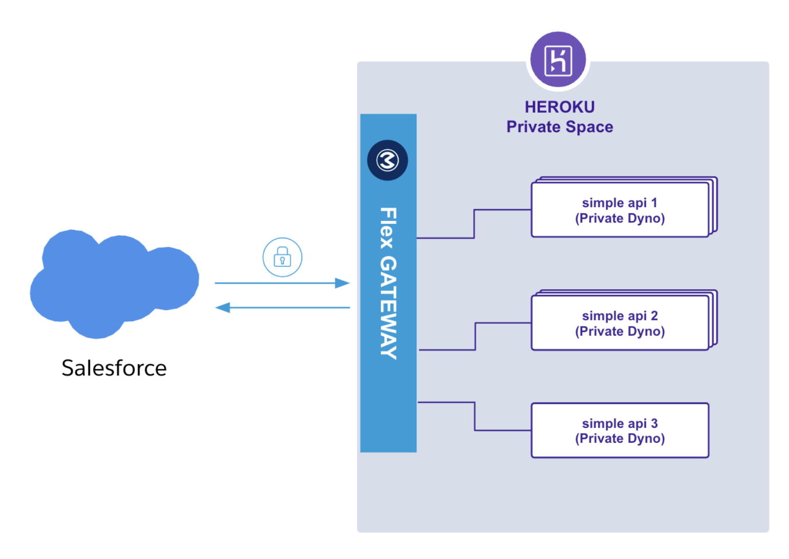

# Heroku Docker - Anypoint Flex Gateway

[](https://heroku.com/deploy)

Deploy the official [MuleSoft Anypoint Flex Gateway Docker image](https://hub.docker.com/r/mulesoft/flex-gateway) to Heroku



## Requirements

- A [Heroku](https://signup.heroku.com/) account
- A [MuleSoft Anypoint Platform](https://www.mulesoft.com/platform/enterprise-integration) account
- [Heroku CLI](https://devcenter.heroku.com/articles/heroku-cli)
- [Docker](https://docs.docker.com/get-docker/)

## Manual Deployment

Create an application on a Private Space with the Heroku CLI using the `--space` flag:

``` sh
heroku create <gateway-app-name> --space <private space>
```

Set the `registration.yaml` configuration contents in the `FLEX_CONFIG` environment variable:

> [!NOTE]
> To generate the `registration.yaml` file you'll need to add a new gateway from the Anypoint Runtime Manager and follow the Container > Docker instructions.

``` sh
heroku config:set FLEX_CONFIG="$(cat registration.yaml)" -a <gateway-app-name>
```

Set the required configuration environment variables to make it work on Heroku:

> [!NOTE]
> For more information about the configuration environment variables take a look at the `app.json` file.

``` sh
heroku config:set FLEX_DYNAMIC_PORT_ENABLE=true -a <gateway-app-name>
heroku config:set FLEX_DYNAMIC_PORT_ENVAR=PORT -a <gateway-app-name>
heroku config:set FLEX_DYNAMIC_PORT_VALUE=8081 -a <gateway-app-name>
heroku config:set FLEX_CONNECTION_IDLE_TIMEOUT_SECONDS=60 -a <gateway-app-name> 
heroku config:set FLEX_STREAM_IDLE_TIMEOUT_SECONDS=300 -a <gateway-app-name>
heroku config:set FLEX_METRIC_ADDR=tcp://127.0.0.1:2000 -a <gateway-app-name>
heroku config:set FLEX_SERVICE_ENVOY_DRAIN_TIME=30 -a <gateway-app-name>
```

Deploy the Flex Gateway to Heroku by running:

``` sh
heroku stack:set container
git push heroku main
```

## Next Steps

After deploying the Flex Gateway to Heroku you'll need to add a new API to it under the Anypoint API Manager, otherwise the Flex Gateway application will restart with a message similar to the following:

> "Error R10 (Boot timeout) -> Web process failed to bind to $PORT within 60 seconds of launch"

## Recommended Concurrency by Dyno type

Depending on the dyno type, to achieve better performance there is our recommended concurrency values:

| Dyno type | FLEX_SERVICE_ENVOY_CONCURRENCY |
|---|---|
| Basic/Standard-{1X,2X} | 1 |
| Performance-{S,M} | 2 |
| Private-{S,M} | 2 |
| Performance-L-RAM | 4 |
| Private-L-RAM | 4 |
| Shield-L-RAM | 4 |
| Performance-L | 8 |
| Performance-XL | 8 |
| Private-XL | 8 |
| Performance-2XL | 16 |
| Private-2XL | 16 |
| Shield-2XL | 16 |

You can set it by running:

``` sh
heroku config:set FLEX_SERVICE_ENVOY_CONCURRENCY=<concurrency-value> -a <gateway-app-name>
```
