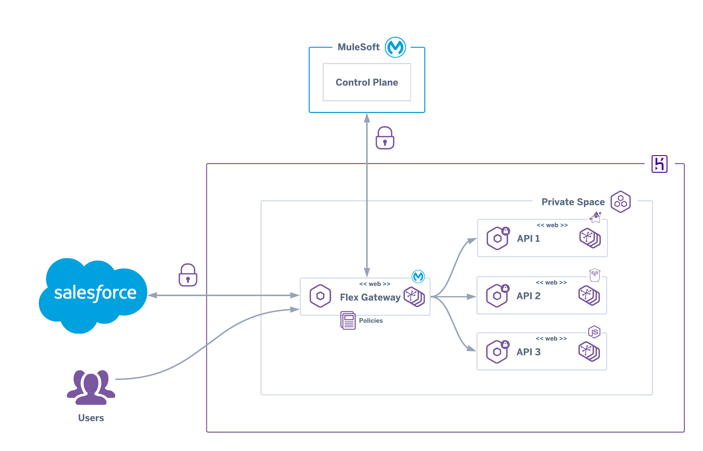

# Heroku Docker - Anypoint Flex Gateway

[](https://heroku.com/deploy)

Deploy the official [MuleSoft Anypoint Flex Gateway Docker image](https://hub.docker.com/r/mulesoft/flex-gateway) to Heroku



## Requirements

- A [Heroku](https://signup.heroku.com/) account
- A [MuleSoft Anypoint Platform](https://www.mulesoft.com/platform/enterprise-integration) account
- [Heroku CLI](https://devcenter.heroku.com/articles/heroku-cli)
- [Docker](https://docs.docker.com/get-docker/)

## Manual Deployment

Create an application on a Private Space with the Heroku CLI using the `--space` flag:

``` sh
heroku create <gw-app-name> --space <private space>
```

Set the `registration.yaml` configuration contents in the `FLEX_CONFIG` environment variable:

``` sh
heroku config:set FLEX_CONFIG="$(cat registration.yaml)" -a <gw-app-name>
```

Deploy the Flex Gateway by running:

``` sh
heroku container:login
heroku container:push web
heroku container:release web
```
